```{r setup, include=FALSE, message=FALSE}
usethis::use_git_ignore(c("*.csv", "*.rds"))
options(htmltools.dir.version = FALSE)

#titleSlideClass: [inverse, center, middle]
#"default", "metropolis", "metropolis-fonts", 

# see options for customize slides: 
# https://slides.yihui.name/xaringan/
# https://slides.yihui.name/xaringan/incremental.html
# https://github.com/yihui/xaringan/wiki

library(knitr)
library(tidyverse)
library(xaringan)
library(kableExtra)
```

class: inverse, center, middle

# Slides

[bretsw.github.io/job-talk-uf](https://bretsw.github.io/job-talk-uf/)

---

class: inverse, center, middle

# Introduction

**Networked Learning in Online Communities**

---

# Networked learning

```{r, out.width = "480px", echo = FALSE, fig.align = "center"}
include_graphics("img/network.jpg")
```

--

- **Definition:** The learning supported by the novel social and environmental conditions created by the internet

--

  - Especially *self-directed* and *just-in-time* (i.e., as needed) learning

--

- **Examples:** searching for curricular materials, looking for peers to discuss ideas for a lesson, seeking out encouragement after a tough day

---

# Online communities

```{r, out.width = "480px", echo = FALSE, fig.align = "center"}

```

--

- **Definition:** A group coming together online around a shared affinity

--

  - This often occurs *informally*, in a *self-organized* way

--

  - May not resemble a traditional, offline community (e.g., local neighborhood, civic organization)

--

- **Examples:** Facebook group, Twitter hashtag, subreddit

---

# Possibilities and perils

```{r, out.width = "720px", echo = FALSE, fig.align = "center"}

```

Networked learning in online communities raises both **possibilities** and **perils**

---

class: inverse, center, middle

# Methods

---

#  Digital traces

```{r, out.width = "600px", echo = FALSE, fig.align = "center"}
include_graphics("img/purpose.jpg")
```

--

- **Definition:** Residual, observable evidence of online activity

--

- **Examples:** tweets, forum posts, user profiles

---

# Learning analytics

```{r, out.width = "480px", echo = FALSE, fig.align = "center"}

```

**Data science and learning analytics** techniques have allowed me to:

--

- Study real world, *in situ* data in massive quantities

--

- Identify patterns and trends in messy datasets

--

-	Infer possibilities and perils

---

# Flexible tools

```{r, out.width = "300px", echo = FALSE, fig.align = "center"}
include_graphics("img/R-logo.png")
```

--

- Large datasets do not open in Excel, so I learned **R**

--

  - programming language and environment for statistical computing and graphics


- Numerous *packages*:

--

  - **ggplot2** for data visualization
  
--
  
  - **igraph** for social network analysis
  
--
  
  - **caret** for machine learning

---

# New tools

```{r, out.width = "480px", echo = FALSE, fig.align = "center"}
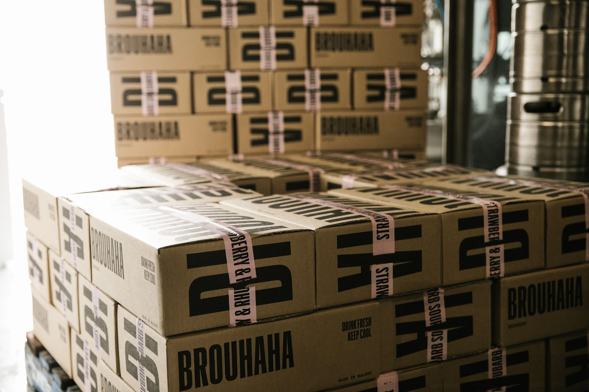
```

--

Sometimes, the tools you need don't exist yet.

--

- I wanted to make data collection and analysis easier for others, so I built an R software package: **tidytags**

--

- Currently in revision with ROpenSci: "best in class" software tools

--

- Freely available at https://bretsw.github.io/tidytags/

---

class: inverse, center, middle

# My research

---

# In sum

```{r, out.width = "600px", echo = FALSE, fig.align = "center"}

```

--

My research uses numerous **data science and learning analytics** techniques

--

to address the **possibilities** and **perils** of networked learning 

--

in a variety of contexts for online communities.

---

class: inverse, center, middle

# Five studies

```{r, out.width = "720px", echo = FALSE, fig.align = "center"}

```

**Possibilities and perils of:**

1. Twitter as a platform for teacher communities
1. Possibilities and perils of dealing with spam
1. Synchronous chats on Twitter
1. Online communities during a global pandemic
1. Reddit as a platform for teacher communities

---

class: inverse, center, middle

# 1. Twitter communities

```{r, out.width = "720px", echo = FALSE, fig.align = "center"}

```

Possibilities and perils of:

1. **Twitter as a platform for teacher communities**
1. Dealing with spam
1. Synchronous chats on Twitter
1. Online communities during a global pandemic
1. Reddit as a platform for teacher communities

---

# 1. Twitter communities

```{r, out.width = "480px", echo = FALSE, fig.align = "center"}

```

<p style="font-size:66%">
Staudt Willet, K. B. (2019). Revisiting how and why educators use Twitter: Tweet types and purposes in #Edchat. <i>Journal of Research on Technology in Education, 51</i>, 273-289. https://doi.org/10.1080/15391523.2019.1611507
</p>

<hr>

--

**Context:** Twitter (\#Edchat hashtag)

--

**Data collection:** 1,228,506 \#Edchat tweets

--

**Data analysis:** tweet type classification, discourse analysis 

---

# Tweet example

```{r, out.width = "540px", echo = FALSE, fig.align = "center"}
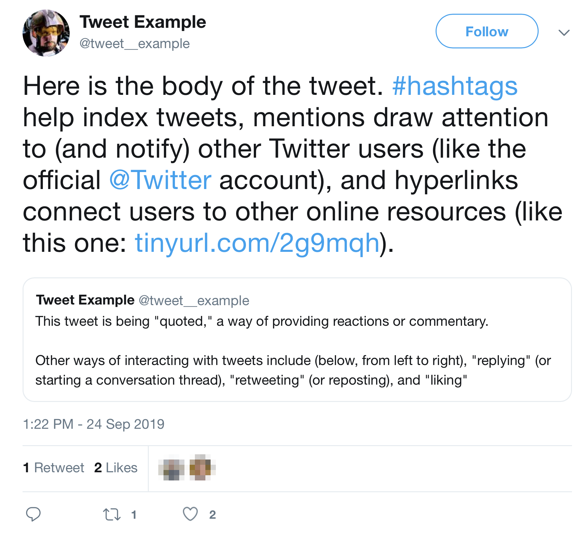
```

---

# Twitter hashtags

```{r, out.width = "300px", echo = FALSE, fig.align = "center"}
include_graphics("img/hashtag.jpg")
```

--

**Many different uses of Twitter hashtags:**

--

- Topical index: #Teaching

--

- Humor and wit: #CoolTeacher

--

- Synchronous chats: #SatChat

--

- "Space" for ongoing discussions: #Edchat, #ITeachMath

---

# \#Edchat background

```{r, out.width = "300px", echo = FALSE, fig.align = "center"}
include_graphics("img/hashtag.jpg")
```

--

- \#Edchat is one of the oldest and busiest educational Twitter hashtags

--

- \#Edchat is self-described as:

> "...Twitter discussion that any educator can discuss and learn about current teaching trends, to integrate technology, to transform their education, and to connect with inspiring instructors around the world."

---

# 1. Twitter communities

```{r, out.width = "840px", echo = FALSE, fig.align = "center"}
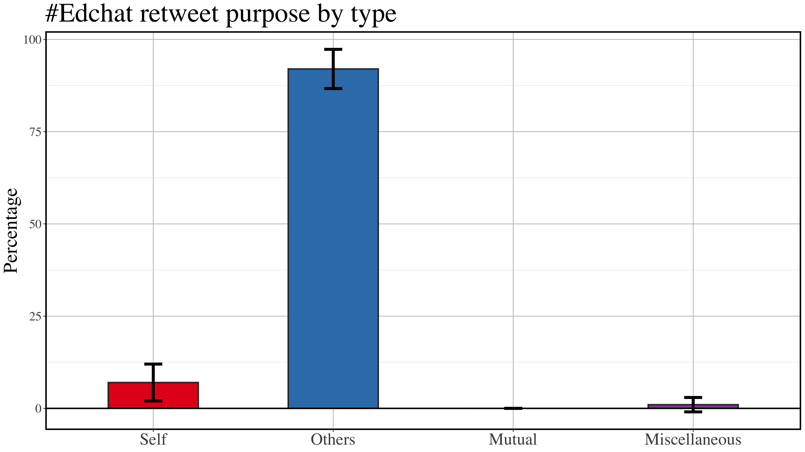
```

---

# 1. Twitter communities

```{r, out.width = "840px", echo = FALSE, fig.align = "center"}
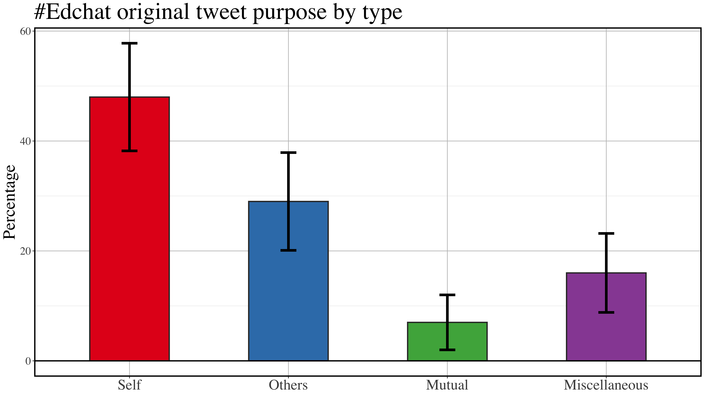
```

---

# 1. Twitter communities

```{r, out.width = "840px", echo = FALSE, fig.align = "center"}
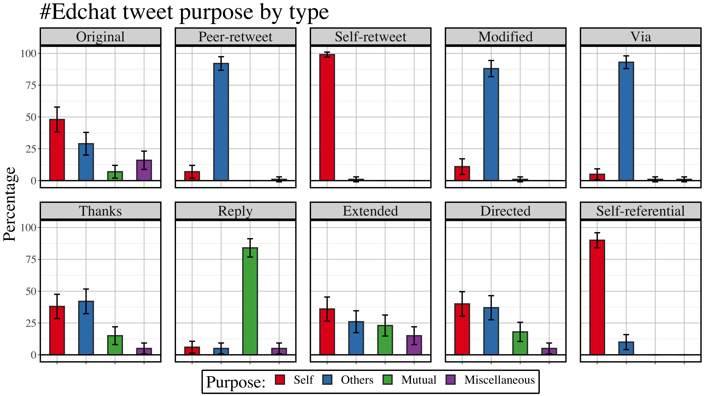
```

---

# 1. Twitter communities

```{r, out.width = "360px", echo = FALSE, fig.align = "center"}

```

### Machine learning classifier

<p style="font-size:66%">
Staudt Willet, K. B., & Willet, B. D. (2018, October). Look who’s talking: Using human coding to establish a machine learning approach to Twitter education chats. In <i>AoIR selected papers of internet research</i>. Association of Internet Researchers. https://spir.aoir.org/ojs/index.php/spir/article/view/10512
</p>

<hr>

--

- Goal: Automatically detect tweet purposes through a *logistic regression classifier*

--

  - identified 39 tweet features

--

  - compared efficacy of 10 different ML methods (e.g., random forest, *k*-nearest neighbors)

---

# 1. Twitter communities

```{r, out.width = "480px", echo = FALSE, fig.align = "center"}

```

### Possibilities

--

- Huge amount of \#Edchat content (i.e., approximately 5,000 daily tweets)

--

- Overwhelmingly on topic

--
  
- High engagement (e.g., retweeting others' content)

--

- Supports different needs

---

# 1. Twitter communities

```{r, out.width = "480px", echo = FALSE, fig.align = "center"}

```

### Perils

--

- Imbalance of needs being supported (e.g., nearly half of new \#Edchat content is **self-promotional** in nature)

--

- Volume of content is likely overwhelming for new Twitter users or new teachers

--

- Trouble with relying on one data source (self-reports or digital traces)

---

class: inverse, center, middle

# 2. Twitter spam

```{r, out.width = "720px", echo = FALSE, fig.align = "center"}

```

Possibilities and perils of:

1. Twitter as a platform for teacher communities
1. **Dealing with spam**
1. Synchronous chats on Twitter
1. Online communities during a global pandemic
1. Reddit as a platform for teacher communities

---

# 2. Twitter spam

```{r, out.width = "480px", echo = FALSE, fig.align = "center"}

```

<p style="font-size:66%">
Carpenter, J. P., Staudt Willet, K. B., Koehler, M. J., & Greenhalgh, S. P. (2020). Spam and educators’ Twitter use: Methodological considerations and challenges. <i>TechTrends, 64</i>, 460-469. https://doi.org/10.1007/s11528-019-00466-3
</p>

<hr>

--

**Context:** Twitter (variety of educational hashtags, e.g., #Edchat, #SatChat)

--

**Data collection:** 1,228,506 #Edchat tweets; 507,071 #SatChat tweets

--

**Data analysis:** secondary analysis, spam detection

---

# 2. Twitter spam

```{r, out.width = "840px", echo = FALSE, fig.align = "center"}
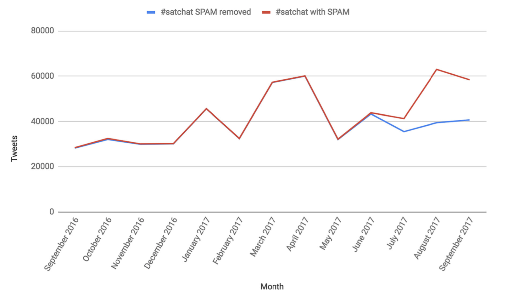
```

---

# 2. Twitter spam

```{r, out.width = "480px", echo = FALSE, fig.align = "center"}

```

### Possibilities

--

- Users generally seem ok with ignoring spam

--

- Researchers can identify spam and remove it from datasets

--

- Spam treatment can add confidence to analysis

---

# 2. Twitter spam

```{r, out.width = "480px", echo = FALSE, fig.align = "center"}

```

### Perils

--

- One account can skew perceptions of a whole community

--

- Time intensive to deal with spam

---

class: inverse, center, middle

# 3. Twitter chats

```{r, out.width = "720px", echo = FALSE, fig.align = "center"}

```

Possibilities and perils of:

1. Twitter as a platform for teacher communities
1. Dealing with spam
1. **Synchronous chats on Twitter**
1. Online communities during a global pandemic
1. Reddit as a platform for teacher communities

---

# 3. Twitter chats

```{r, out.width = "480px", echo = FALSE, fig.align = "center"}

```

<p style="font-size:66%">
Greenhalgh, S. P., Rosenberg, J. M., Staudt Willet, K. B., Koehler, M. J., & Akcaoglu, M. (2020). Identifying multiple learning spaces within a single teacher-focused Twitter hashtag. <i>Computers and Education, 148</i>, 103809. https://doi.org/10.1016/j.compedu.2020.103809
</p>

<hr>

--

**Context:** Twitter (\#michED hashtag)

--

**Data collection:** 84,004 \#michED tweets

--

**Data analysis:** natural language processing, multi-level modeling

---

# 3. Twitter chats

```{r, out.width = "480px", echo = FALSE, fig.align = "center"}

```

--

**Definition** of a Twitter *chat*:

--

- Agreed upon time (usually one hour every week) 

--

- A moderator posts questions using a hashtag

--

- Others respond more or less immediately using the same hashtag

---

# 3. Twitter chats
 
### Findings

&nbsp;
 
```{r, echo=FALSE, message=FALSE}
knitr::kable(
  bind_cols(
    c("18,816 tweets overall",
      "361.8 tweets per hour", 
      "Higher social processing and cognitive processing",
      "More likes and replies"
    ),
    c("65,188 tweets overall",
      "7.5 tweets per hour", 
      "",
      "More retweets, mentions, hashtags, and hyperlinks"
    )
  ),
  col.names = c("Synchronous chats", 
                "Asynchronous times"),
  format = 'html',
  table.attr = "style='width:90%;'"
) %>%
  kableExtra::kable_styling(
    bootstrap_options = c("striped", "hover"),
    full_width=TRUE
  ) %>%
  kableExtra::column_spec(1, 
                          width_min = "10em",
                          width_max = "15em"
  ) %>%
  kableExtra::column_spec(2, 
                          width_min = "10em",
                          width_max = "15em"
  ) %>%
  kableExtra::row_spec(0, align = 'center')
```

---

# 3. Twitter chats

```{r, out.width = "480px", echo = FALSE, fig.align = "center"}

```

### Possibilities

--

- Community within a community: the same digital space may be used in different ways

--

- Chats generate especially high volume (muhc higher tweet density)

--

- Chats generate conversational engagement (higher cognitive and social proocessing)

---

# 3. Twitter chats

```{r, out.width = "480px", echo = FALSE, fig.align = "center"}

```

### Perils

--

- Volume may be too high (i.e., 360 tweets/hour = a new tweet every 10 seconds)

--

- Less connecting to broader perspectives during a chat (i.e., fewer mentions, hashtags, hyperlinks)

---

class: inverse, center, middle

# 4. Pandemic Twitter

```{r, out.width = "720px", echo = FALSE, fig.align = "center"}

```

Possibilities and perils of:

1. Twitter as a platform for teacher communities
1. Dealing with spam
1. Synchronous chats on Twitter
1. **Online communities during a global pandemic**
1. Reddit as a platform for teacher communities

---

# 4. Pandemic Twitter

```{r, out.width = "480px", echo = FALSE, fig.align = "center"}

```

<p style="font-size:66%">
Greenhow, C. M., Staudt Willet, K. B., & Galvin, S. (in revision). Inquiring tweets want to know: #Edchat supports for #RemoteTeaching during COVID-19. <i>British Journal of Educational Technology</i>.
</p>

<hr>

--

**Context:** Twitter (\#Edchat hashtag)

--

**Data collection:** 589,770 \#Edchat tweets spanning 2019 and 2020

--

**Data analysis:** trend analysis, natural language processing, topic modeling

---

# 4. Pandemic Twitter

```{r, out.width = "480px", echo = FALSE, fig.align = "center"}

```

### Findings

--

Common terms across all topics in both years:

- edtech
- learn(-ing)
- teach(-ing or -er)
- school

---

# 4. Pandemic Twitter

### Findings
 
&nbsp;
 
```{r, echo=FALSE, message=FALSE}
knitr::kable(
  bind_cols(
    c("Two topics: New K-12 resources", 
      "Two topics: Teaching",
      "One topic: Reading"
    ),
    c("Two topics: Communicating a sense of urgency", 
      "Two topics: Pandemic themes",
      "One topic: Appealing to fellow educators (i.e., 'edutwitter') for free classroom resources"
    )
  ),
  col.names = c("2019", "2020"),
  format = 'html',
  table.attr = "style='width:90%;'"
) %>%
  kableExtra::kable_styling(
    bootstrap_options = c("striped", "hover"),
    full_width=TRUE
  ) %>%
  kableExtra::column_spec(1, 
                          width_min = "10em",
                          width_max = "15em"
  ) %>%
  kableExtra::column_spec(2, 
                          width_min = "10em",
                          width_max = "15em"
  ) %>%
  kableExtra::row_spec(0, align = 'center')
```

---

# 4. Pandemic Twitter

```{r, out.width = "480px", echo = FALSE, fig.align = "center"}

```

### Possibilities

--

- Online communities adapt to external, contextual circumstances

--

- Primary purpose of the community (i.e., education, ed tech) remains the same
--

- Multiple needs are supported

---

# 4. Pandemic Twitter

```{r, out.width = "480px", echo = FALSE, fig.align = "center"}

```

### Perils

--

- Unknown quality of resources and opinions being shared

--

- Exacerbates existing differences between those who have time and agency to independently pursue their own supports and those who don't

---

class: inverse, center, middle

# 5. Reddit communities

```{r, out.width = "720px", echo = FALSE, fig.align = "center"}

```

Possibilities and perils of:

1. Twitter as a platform for teacher communities
1. Dealing with spam
1. Synchronous chats on Twitter
1. Online communities during a global pandemic
1. **Reddit as a platform for teacher communities**

---

# 5. Reddit communities

```{r, out.width = "600px", echo = FALSE, fig.align = "center"}
include_graphics("img/across-time.jpg")
```

<p style="font-size:66%">
Staudt Willet, K. B., & Carpenter, J. P. (in press). A tale of two subreddits: Change and continuity in teaching-related online spaces. <i>British Journal of Educational Technology</i>. https://doi.org/10.1111/bjet.13051
</p>

<hr>

--

**Context:** Reddit (themed discussion forums called *subreddits*)

--

**Data collection:** 1,036,278 Reddit posts and comments from two subreddits, spanning 3.5 years

--

**Data analysis:** trend analysis, natural language processing, social network analysis

---

# 5. Reddit communities

### Findings
 
&nbsp;
 
```{r, echo=FALSE, message=FALSE}
knitr::kable(
  bind_cols(
    c("Subscribers",
      "Contributors",
      "Posts",
      "Comments"
    ),
    c("204,000",
      "55,148", 
      "54,933",
      "641,727"
    ),
    c("122,000",
      "43,711", 
      "252,340",
      "82,278"
    )
  ),
  col.names = c("", 
                "r/Teachers", 
                "r/education"),
  format = 'html',
  table.attr = "style='width:90%;'"
) %>%
  kableExtra::kable_styling(
    bootstrap_options = c("striped", "hover"),
    full_width=TRUE
  ) %>%
  kableExtra::row_spec(0, align = 'center')
```

---

# 5. Reddit communities

### Findings

```{r, out.width = "720px", echo = FALSE, fig.align = "center"}
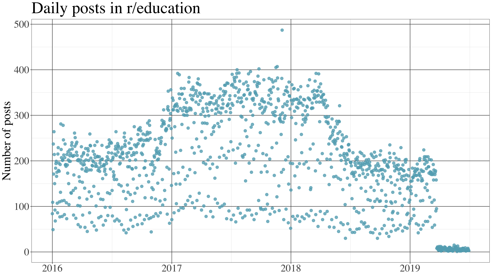
```

---

# 5. Reddit communities

### Findings

```{r, out.width = "720px", echo = FALSE, fig.align = "center"}
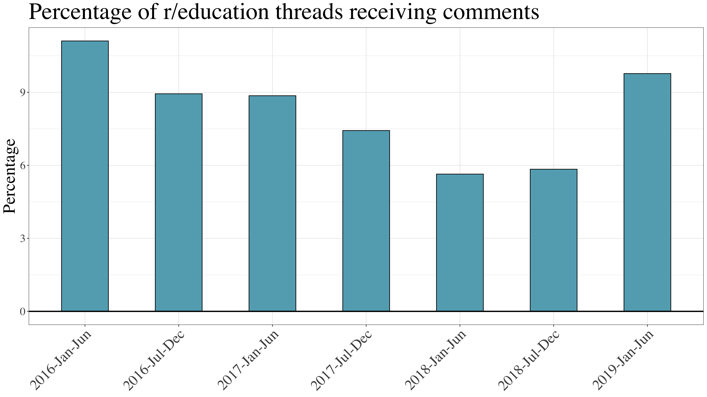
```

---

# 5. Reddit communities

### Findings

```{r, out.width = "720px", echo = FALSE, fig.align = "center"}
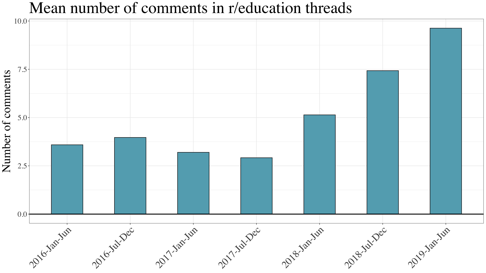
```

---

# 5. Reddit communities

### Findings

```{r, out.width = "720px", echo = FALSE, fig.align = "center"}
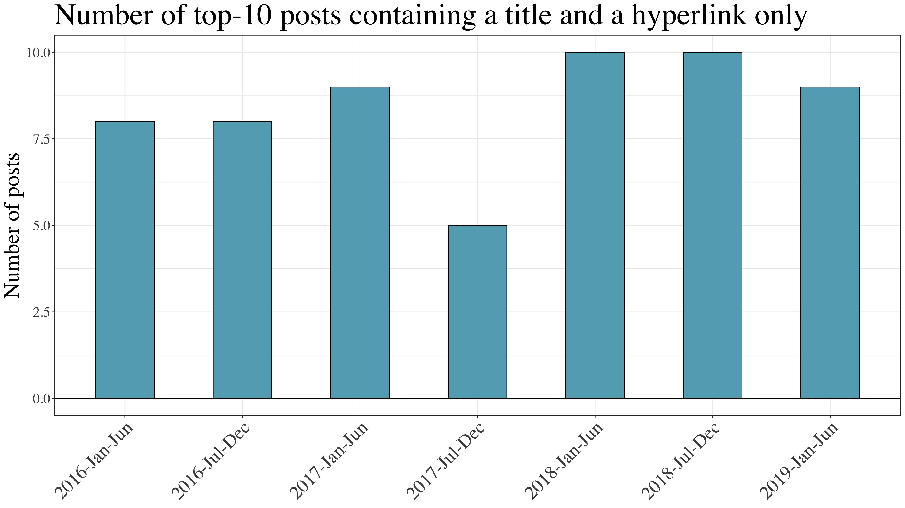
```

---

# 5. Reddit communities

```{r, out.width = "480px", echo = FALSE, fig.align = "center"}
include_graphics("img/across-time.jpg")
```

### Possibilities

--

- Reddit communities are big and growing (despite fewer posts in r/education)

--

- Variety of topics, potentially something for everyone

--

- Moderated space may improve focus and quality of conversation

--

- Anonymity may increase honesty in sharing

--

- Continuity and change of various measures in relationship with each other may suggest more nuanced interpretation

---

# 5. Reddit communities

```{r, out.width = "480px", echo = FALSE, fig.align = "center"}
include_graphics("img/across-time.jpg")
```

### Perils

--

- Uneven experience between communities and within communities

--

- Overwhelmingly predominant sharing of hyperlinks alone in r/education

--

- Anonymity may increase toxicity in sharing

--

- Online participation can change quickly, meaning a snapshot may be misleading

---

class: inverse, center, middle

# Five studies

```{r, out.width = "720px", echo = FALSE, fig.align = "center"}

```

**Possibilities and perils of:**

1. Twitter as a platform for teacher communities
1. Possibilities and perils of dealing with spam
1. Synchronous chats on Twitter
1. Online communities during a global pandemic
1. Reddit as a platform for teacher communities

---

class: inverse, center, middle

# Significance

---

# Possibilities

```{r, out.width = "540px", echo = FALSE, fig.align = "center"}
include_graphics("img/chat.jpg")
```

--

- Many online communities are big, sustained, growing.

--

-	**For participants:** There's something for everyone: resources, links to articles, conversations, encouragement, social hang outs

--

-	**For researchers:** Public behavior, open to study, big complex data

---

# Perils

```{r, out.width = "540px", echo = FALSE, fig.align = "center"}

```

--

- **Equity** issues are foregrounded: takes time to self-direct learning and build informal online communities &mdash; *Who has time to keep up?*

--

-	**For participants:** Uneven experience: spam, self-promotion, sharing links without context or comment

--

-	**For researchers:** Complicated and nuanced ethical concerns get raised

---

# Possibilities and perils

```{r, out.width = "480px", echo = FALSE, fig.align = "center"}
include_graphics("img/jurassic-park.jpg")
```

"Your scientists were so preoccupied with whether they *could*, they didn't stop to think if they *should*."

~ Dr. Ian Malcolm, *Jurassic Park*

--

<hr>

Alternative talk title: 

*Networked learning: Your bioengineered T-Rex is awesome, but she will likely eat you*

---

class: inverse, center, middle

# Future research

---

# Tools

```{r, out.width = "480px", echo = FALSE, fig.align = "center"}
include_graphics("img/construction.jpg")
```

I will **develop tools** to support networked learning research:

--

- R package for Reddit data collection and analysis

--

- Web apps for characterizing online communities on Twitter and Reddit

---

# Literacies

```{r, out.width = "420px", echo = FALSE, fig.align = "center"}

```

I will **develop digital literacies** for teachers coming into the field

--

- Create recommendations for using social media to pursue the possibilities of networked learning and avoid the perils:

--

- Create guidelines for emergency disaster response (e.g., pandemic)

--

- Create guidelines for job transitions: e.g., new teachers, new faculty, promotions (in progress)

---

# Equity

```{r, out.width = "420px", echo = FALSE, fig.align = "center"}
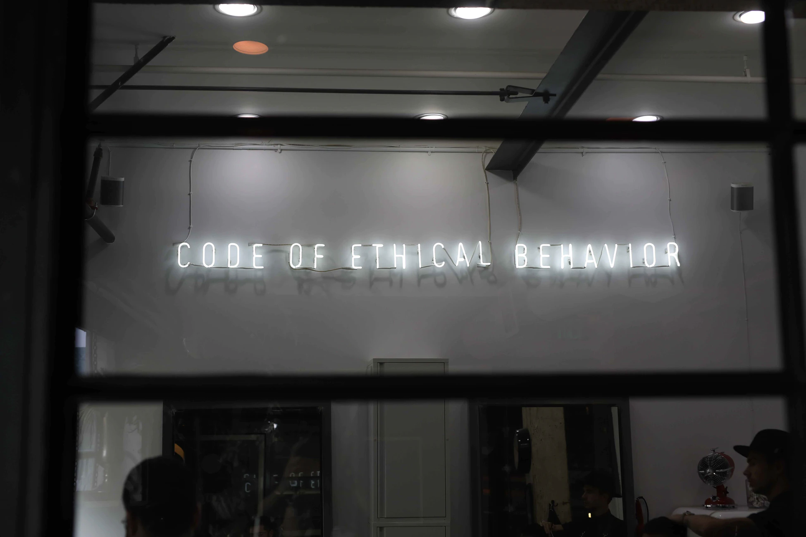
```

--

I will **develop communities focused on equity** 

--

- Create recommendations for building and facilitating online communities that address inequities

--

- Leverage research findings to incorporate social media features (e.g., moderation) to increase inclusivity

--

- Research motivations of participation by "lurkers" to better engage them

---

class: inverse, left, top

# Thank you!

```{r, out.width = "420px", echo = FALSE, fig.align = "center"}
include_graphics("img/chat.jpg")
```

* **Email:** [staudtwi@msu.edu](mailto:staudtwi@msu.edu)

* **Web:** [bretsw.com](http://bretsw.com)

* **Twitter:** [@bretsw](https://twitter.com/bretsw)

* **GitHub:** [bretsw](https://github.com/bretsw)

* **Slides:** [bretsw.github.io/job-talk-uf](https://bretsw.github.io/job-talk-uf)
