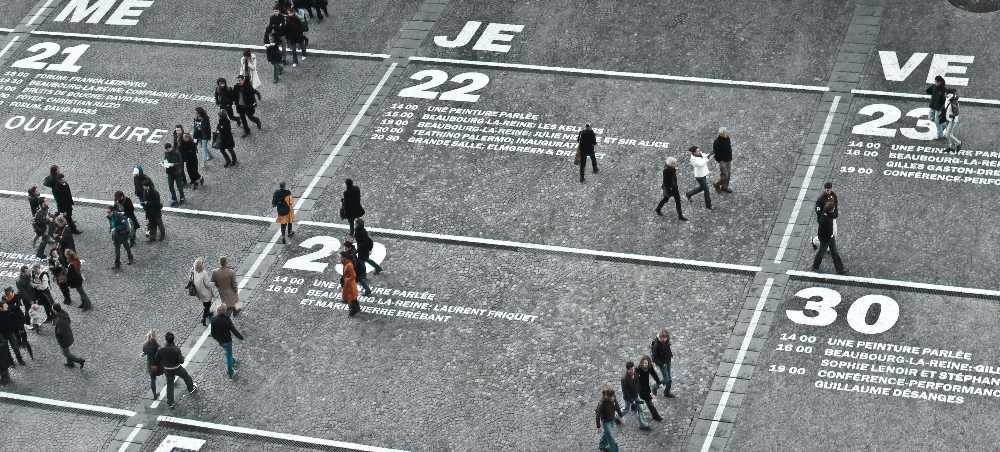

```{r setup, include=FALSE}
usethis::use_git_ignore(c("*.csv", "*.rds"))
options(htmltools.dir.version = FALSE)

#titleSlideClass: [inverse, center, middle]
#"default", "metropolis", "metropolis-fonts", 

# see options for customize slides: 
# https://slides.yihui.name/xaringan/
# https://slides.yihui.name/xaringan/incremental.html
# https://github.com/yihui/xaringan/wiki

library(knitr)
library(tidyverse)
library(xaringan)
```

class: inverse, center, middle

# Slides

[bretsw.github.io/job-talk-uf](https://bretsw.github.io/job-talk-uf)

---

class: inverse, center, middle

# Background

```{r, out.width = "720px", echo = FALSE, fig.align = "center"}

```

---

# Networked learning

```{r, out.width = "600px", echo = FALSE, fig.align = "center"}
include_graphics("img/network.jpg")
```

--

The internet is an advanced learning technology

--

whose affordances and constraints create novel social and environmental conditions for learning

---

# Networked learning

### My research agenda:

```{r, out.width = "480px", echo = FALSE, fig.align = "center"}

```

--

To better understand the **possibilities** and **perils** of networked learning in online communities

--

through data science and learning analytics approaches

---

# Networked learning possibilities

```{r, out.width = "480px", echo = FALSE, fig.align = "center"}
include_graphics("img/chat.jpg")
```

--

**Why** do teachers come together through social media?

--

- to self-direct their professional learning

--

- to find and share teaching resources

--

- to vent and seek emotional support

---

# Networked learning possibilities

```{r, out.width = "420px", echo = FALSE, fig.align = "center"}
include_graphics("img/purpose.jpg")
```

--

**When** do teachers come together through social media?

--

- Developing new skills

--

- Adopting new curriculum or standards

--

- Transitioning to a new job

--

- Navigating COVID-19 disruptions

---

# Networked learning perils

```{r, out.width = "480px", echo = FALSE, fig.align = "center"}
include_graphics("img/jurassic-park.jpg")
```

"Your scientists were so preoccupied with whether they *could*, they didn't stop to think if they *should*." ~ Dr. Ian Malcolm, *Jurassic Park*

--

-	Demands for time, energy, cognitive load can overwhelm agency

--

- Context collapse

--

-	Data privacy, commodification of users

---

# Interdisciplinary research

```{r, out.width = "420px", echo = FALSE, fig.align = "center"}
include_graphics("img/purpose.jpg")
```

This work is brings together ideas from numerous disciplines:

--

- Learning analytics and data science

--

- Emerging technologies

--

- Information science

--

- Teacher education and teacher learning

---

# Multiple methods

```{r, out.width = "360px", echo = FALSE, fig.align = "center"}

```

This work analyzes **digital traces** in a variety of ways:

--

- **Contribution trends**

--

- **Text analysis**: sentiment, discourse, natural language processing

--

- **Text classification**: topic modeling  (log odds ratio, PCA topics), machine learning (logistic regression classifier)

--

- **Social network analysis**: visual, descriptive (reciprocity, transitivity), inferential (influence, selection, spin glass clustering)

---

class: inverse, center, middle

# Roadmap

```{r, out.width = "840px", echo = FALSE, fig.align = "center"}
include_graphics("img/map.jpg")
```

---

# Roadmap

```{r, out.width = "840px", echo = FALSE, fig.align = "center"}
include_graphics("img/map.jpg")
```

--

1. Project A: Different spaces for different purposes

--

1. Project B: Adaptability of purposes

--

1. Implications

--

1. Future research

---

class: inverse, left, top

# 1. Project A: Different spaces for different purposes

```{r, out.width = "840px", echo = FALSE, fig.align = "center"}
include_graphics("img/map.jpg")
```

Roadmap:
1. **Project A: Different spaces for different purposes**
1. Project B: Adaptability of purposes
1. Implications
1. Future research

---

# Different spaces, purposes

### Project A: Teaching-related subreddits

--

- Teachers on Reddit? Exploring contributions ands interactions in four teaching-related subreddits (*Journal of Research on Technology in Education*, 2020)

--

- A tale of two subreddits: Change and continuity in teaching-related online spaces (*British Journal of Educational Technology*, 2021)

--

```{r, out.width = "600px", echo = FALSE, fig.align = "center"}

```

**Question:** How have the r/Teachers and r/education subreddits changed, or remained the same, over time?

---

# Different spaces, purposes

### Project A: Teaching-related subreddits

**Rise and fall of Myspace**

```{r, out.width = "600px", echo = FALSE, fig.align = "center"}
include_graphics("img/myspace.png")
```

[*Image source: Business Insider (2011)*](https://www.businessinsider.com/chart-of-the-day-the-fall-of-myspace-2011-6)

---

# Different spaces, purposes

### Project A: Teaching-related subreddits

```{r, out.width = "200px", echo = FALSE, fig.align = "center"}
include_graphics("img/reddit-logo.png")
```

**Reddit background**

--

1. \#7 website in the United States; \#18 in the world

--

1. Collection of discussion forums (i.e., **subreddits**)

--

1. Threaded discussions: **posts** and **responses**

--

1. Voting: **+1** or **-1**

--

1. Anonymity

---

# Different spaces, purposes

### Project A: Teaching-related subreddits

**Reddit example**

```{r, out.width = "840", echo = FALSE, fig.align = "center"}
include_graphics("img/reddit-example.jpg")
```

---

# Different spaces, purposes

### Project A: Teaching-related subreddits

```{r, out.width = "240px", echo = FALSE, fig.align = "center"}
include_graphics("img/reddit-logo.png")
```

--

- Education in general (e.g., r/education)

--

- Education level (e.g., r/highereducation)

--

- Subject area (e.g., r/historyteachers, r/matheducation, r/MusicEd)

---

# Different spaces, purposes

### Project A: Teaching-related subreddits

**Comparing two subreddits:**

[**reddit.com/r/Teachers**](https://www.reddit.com/r/Teachers/) | [**reddit.com/r/education**](https://www.reddit.com/r/education/)

```{r, out.width = "360px", echo = FALSE, fig.align = "center"}
include_graphics("img/teacher.jpg")
```

--

- Both  part of the Reddit Education Network (16 subreddits)

--

- Highest subscription of teaching-related subreddits

--

  - **r/Teachers:** 192,000 subscribers

--

  - **r/education:** 119,000 subscribers

---

# Different spaces, purposes

### Project A: Teaching-related subreddits

**Framework: Learning ecologies**

```{r, out.width = "480x", echo = FALSE, fig.align = "center"}
include_graphics("img/network.jpg")
```

--

- Complementary components

--

- Transitions (i.e., change over time)

---

# Different spaces, purposes

### Project A: Teaching-related subreddits

**Framework: Affinity spaces**

```{r, out.width = "480px", echo = FALSE, fig.align = "center"}
include_graphics("img/empty-space.jpg")
```

--

- Individual contributions

--

- Content interactions

--

- Social interactions

---

# Different spaces, purposes

### Project A: Teaching-related subreddits

```{r, out.width = "200px", echo = FALSE, fig.align = "center"}
include_graphics("img/reddit-logo.png")
```

**Data collection of digital traces:**

--

- **3.5 years** (42 months): from January 1, 2016 to June 30, 2019

--

- More than a million Reddit contributions spanning three-and-a-half years:

--

  - 54,933 posts and 641,727 comments in **r/Teachers** from 55,148 users

--

  - 252,340 posts and 87,278 comments in **r/education** from 43,711 users

---

# Different spaces, purposes

### Project A: Teaching-related subreddits

```{r, out.width = "200px", echo = FALSE, fig.align = "center"}
include_graphics("img/reddit-logo.png")
```

**Analysis:** Trends over 3.5 years &mdash; five quantitative and qualitative measures: 

--

- **Quantitative analysis** of individual contributions, content interactions, and social interactions

--

- **Qualitative analysis** of topics of conversation and types of discourse in top-ten posts (defined by highest voting scores) in each subreddit, and up to the top-ten responses to each of these

--

- 2 subreddits x 7 time periods x 10 posts =  **140 posts**

--

- 2 subreddits x 7 time periods x 100 responses = **1,460 responses**

---

# Different spaces, purposes

**Daily contributions to r/Teachers and r/education**

```{r, out.width = "840px", echo = FALSE, fig.align = "center"}
include_graphics("img/subreddit-contributions-over-time-comparison.png")
```

---

# Different spaces, purposes

**Post topics and discourse in r/Teachers and r/education**

```{r, out.width = "450px", echo = FALSE, fig.align = "center"}
include_graphics("img/subreddit-post-plot-bar.png")
```

---

# Different spaces, purposes

**Change and continuity**

```{r, out.width = "360px", echo = FALSE, fig.align = "center"}
include_graphics("img/threads.jpg")
```

--

- **r/Teachers:** Individual contributions increased steadily, clustering decreased, mutuality increased, topics consistently included teachers’ lived experiences and pedagogy
  
--

- **r/education:** Posts and posters declined, thread length increased, clustering decreased, mutuality increased, topics consistently included education policy and societal factors
  
---

# Different spaces, purposes

**Distinct purposes**

```{r, out.width = "480px", echo = FALSE, fig.align = "center"}

```

--

- **r/Teachers:** a conversational space or a teachers’ lounge 

--

  - many responses, long threads, educators' lived experiences

--

- **r/education:** a bulletin board space or a debate hall

--

  - many posts, few responses, more content-focused

---

# Different spaces, purposes

**Significance**

```{r, out.width = "360px", echo = FALSE, fig.align = "center"}
include_graphics("img/scatter.jpg")
```

--

- Teachers' self-directed learning is tied to context and has a temporal dimension

--

- Need to advise aspiring teachers how best to combine different spaces for maximum effect

--

- There is value to anonymous spaces for educators

--

  - Example: Place to vent and unburden emotions from COVID-19 disruptions and frustrations

---

# Different spaces, purposes

### Project A: Teaching-related subreddits

**Conclusion**

```{r, out.width = "480px", echo = FALSE, fig.align = "center"}

```

--

- Self-directed learning on Reddit is different than visiting a library

--

- Educators must work to become critical consumers of ideas and materials encountered in online spaces 

--

- Educators, instructional designers, and scholars must continue to reflect upon and analyze both opportunities and challenges of self-directed learning in the complex ecologies of social media spaces

---

class: inverse, left, top

# 2. Project B: Adaptability of purposes

```{r, out.width = "840px", echo = FALSE, fig.align = "center"}
include_graphics("img/map.jpg")
```

Roadmap:
1. Project A: Different spaces for different purposes
1. **Project B: Adaptability of purposes**
1. Implications
1. Future research

---

# Adaptability of purposes

### Project B: Educational Twitter hashtags

- {tidytags} R package (*ROpenSci*, in revision)

--

- The educational response to COVID-19 across two countries: A critical examination of initial digital pedagogy adoption (*Technology, Pedagogy and Education*, 2021)

--

- Inquiring tweets want to know: #Edchat supports for #RemoteTeaching during COVID-19 (*British Journal of Educational Technology*, in revision)

--

```{r, out.width = "180px", echo = FALSE, fig.align = "center"}
include_graphics("img/hashtag.jpg")
```

**Questions:**

1. How, if it all, did participation in #Edchat change during COVID-19?
1. What questions did teachers ask in #Edchat during COVID-19? 

---

# Adaptability of purposes

### Project B: Educational Twitter hashtags

**Twitter background**

```{r, out.width = "180px", echo = FALSE, fig.align = "center"}
include_graphics("img/hashtag.jpg")
```

--

1. \#35 website in the United States; \#46 in the world

--

1. Microblogging platform: Collection of many brief posts of 280 characters or less (i.e., **tweets**)

--

1. Ad hoc discussions: **replies** and **quote tweets**

--

1. Signal boosting: **likes** and **retweets**

--

1. Twitter profiles are often linked to real identities

---

# Adaptability of purposes

### Project B: Educational Twitter hashtags

```{r, out.width = "540", echo = FALSE, fig.align = "center"}
include_graphics("img/tweet-example.png")
```

---

# Adaptability of purposes

### Project B: Educational Twitter hashtags

**Many different uses of Twitter hashtags**

```{r, out.width = "180px", echo = FALSE, fig.align = "center"}
include_graphics("img/hashtag.jpg")
```

--

- Topical index: #Teaching

--

- Humor and wit: #CoolTeacher

--

- Synchronous chats: #SatChat

--

- "Space" for ongoing discussions: #Edchat, #ITeachMath

---

# Adaptability of purposes

### Project B: Educational Twitter hashtags

**\#Edchat background**

```{r, out.width = "180px", echo = FALSE, fig.align = "center"}
include_graphics("img/hashtag.jpg")
```

--

- \#Edchat is one of the oldest and busiest educational Twitter hashtags

--

- \#Edchat is self-described as:

> "...Twitter discussion that any educator can discuss and learn about current teaching trends, to integrate technology, to transform their education, and to connect with inspiring instructors around the world."

---

# Adaptability of purposes

### Project B: Educational Twitter hashtags

**Framework: Professional learning networks (PLNs)**

```{r, out.width = "420x", echo = FALSE, fig.align = "center"}
include_graphics("img/network.jpg")
```

--

PLNs are systems of: 

--

- interpersonal **connections** 

--

- and **resources** (knowledge, skills, curricular materials, and encouragement)

--

- that support **informal learning**

---

# Adaptability of purposes

### Project B: Educational Twitter hashtags

```{r, out.width = "180px", echo = FALSE, fig.align = "center"}
include_graphics("img/hashtag.jpg")
```

The worldwide COVID-19 pandemic in 2020 has resulted in economic and social disruption of an unprecedented scale.

--

Is Twitter a flexible and adaptable part of teachers' PLNs?

--

**Questions:**

1. How, if it all, did participation in #Edchat change during COVID-19?
1. What questions did teachers ask in #Edchat during COVID-19? 

---

# Adaptability of purposes

### Project B: Educational Twitter hashtags

```{r, out.width = "180px", echo = FALSE, fig.align = "center"}
include_graphics("img/hashtag.jpg")
```

**Data collection of digital traces:**

--

- Collected tweet from March 1 - May 31, 2019 and 2020:

--

  - 332,067 tweets in **2019**

--

  - 257,703 tweets in **2020**
  
--

- Compared tweets containing **questions** in 2019 vs. 2020:

--

  - 15,584 question tweets in **2019**

--

  - 12,901 question tweets in **2020**

---

# Adaptability of purposes

**Daily \#Edchat tweets in 2019 vs. 2020**

```{r, out.width = "840px", echo = FALSE, fig.align = "center"}
include_graphics("img/daily-tweets-comparison.png")
```

---

# Adaptability of purposes

**Hashtags in \#Edchat tweets in 2019 vs. 2020**

```{r, out.width = "840px", echo = FALSE, fig.align = "center"}

```

---

# Adaptability of purposes

**Topics in \#Edchat question tweets in 2019 vs. 2020**

```{r, out.width = "680px", echo = FALSE, fig.align = "center"}
include_graphics("img/topics-2019-2020-questions.png")
```

---

# Adaptability of purposes

### Project B: Educational Twitter hashtags

**Findings**

```{r, out.width = "180px", echo = FALSE, fig.align = "center"}
include_graphics("img/hashtag.jpg")
```

--

- Across all topics in both years, terms like edtech, learn(-ing), teach(-ing or -er), and school were common

--

- **2019:** Looking for help &mdash; new K-12 resources (Topics 1, 3), related to classroom teaching (Topics 4, 5), and specific subjects like reading (Topic 2)

--

- **2020:** Increased sense of urgency (Topics 1, 2), appeals to fellow educators through “edutwitter" seeking free classroom resources (Topic 5), pandemic themes( Topics 3, 4)

---

# Adaptability of purposes

### Project B: Educational Twitter hashtags

**Significance**

```{r, out.width = "480px", echo = FALSE, fig.align = "center"}
include_graphics("img/scatter.jpg")
```

--

- Flexible content

--

- Just-in-time professional development through an emergency response network

---

class: inverse, left, top

# 3. Implications

```{r, out.width = "840px", echo = FALSE, fig.align = "center"}
include_graphics("img/map.jpg")
```

Roadmap:
1. Project A: Different spaces for different purposes
1. Project B: Adaptability of purposes
1. **Implications**
1. Future research

---

# Implications

### Networked learning in online communities

**Possibilities**

```{r, out.width = "360px", echo = FALSE, fig.align = "center"}
include_graphics("img/possibilities.jpg")
```

--

Social media platforms online learning environments as part of broad **learning ecologies**, characterized by:

--

- Complementary components (different spaces for different purposes)

--

- Transitions (change over time)

--

- Intentional participation in and use of PLNs (adaptability of purposes)

---

# Implications

### Networked learning in online communities

**Perils**

```{r, out.width = "480px", echo = FALSE, fig.align = "center"}
include_graphics("img/jurassic-park.jpg")
```

--

- Volume and noise

--

- Variety of negative actors

--

- Companies driven by profits at expense of users

--

- Agency is a finite resource

---

class: inverse, left, top

# 4. Future research

```{r, out.width = "840px", echo = FALSE, fig.align = "center"}
include_graphics("img/map.jpg")
```

Roadmap:
1. Project A: Different spaces for different purposes
1. Project B: Adaptability of purposes
1. Implications
1. **Future research**

---

# Future research

### Networked learning in online communities

```{r, out.width = "600px", echo = FALSE, fig.align = "center"}

```

--

My past work has shown that data science and learning analytics techniques can bring important insight into teachers' professional learning through social media

---

# Future research

### Networked learning in online communities

```{r, out.width = "480px", echo = FALSE, fig.align = "center"}
include_graphics("img/transition.jpg")
```

More work is needed to understand **learning during transitions**:

--

- Disaster response (e.g., pandemics)

--

- Job transitions (e.g., new teachers, new faculty, promotions)

--

- Skill development (e.g., educational data science)
  
---

# Future research

### Networked learning in online communities

```{r, out.width = "480px", echo = FALSE, fig.align = "center"}
include_graphics("img/ethics.png")
```

More work is needed around **technoethics**:

--

- Balancing privacy and open science
  
--

- Recommendations for social media users and dissemination of research
  
--

- Accountability for tech companies

---

# Future research

### Networked learning in online communities

```{r, out.width = "480px", echo = FALSE, fig.align = "center"}
include_graphics("img/construction.jpg")
```

More work is needed **to keep building and improving** these works-in-progress:

--

- R packages for data collection and analysis (Twitter, Reddit)

--

- Web apps for classifying learning spaces (Twitter, Reddit)

---

# Networked learning

```{r, out.width = "540px", echo = FALSE, fig.align = "center"}
include_graphics("img/network.jpg")
```

--

- Affordances and constraints of the internet create novel social and environmental conditions for learning

--

- These can be studied through data science and learning analytics techniques

--

- This advanced learning technology is worth further study and investment

---

class: inverse, left, top

# Questions?

```{r, out.width = "360px", echo = FALSE, fig.align = "center"}
include_graphics("img/question.jpg")
```

* **Email:** [staudtwi@msu.edu](mailto:staudtwi@msu.edu)

* **Web:** [bretsw.com](http://bretsw.com)

* **Twitter:** [@bretsw](https://twitter.com/bretsw)

* **GitHub:** [bretsw](https://github.com/bretsw)

* **Slides:** [bretsw.github.io/job-talk-uf](https://bretsw.github.io/job-talk-uf)