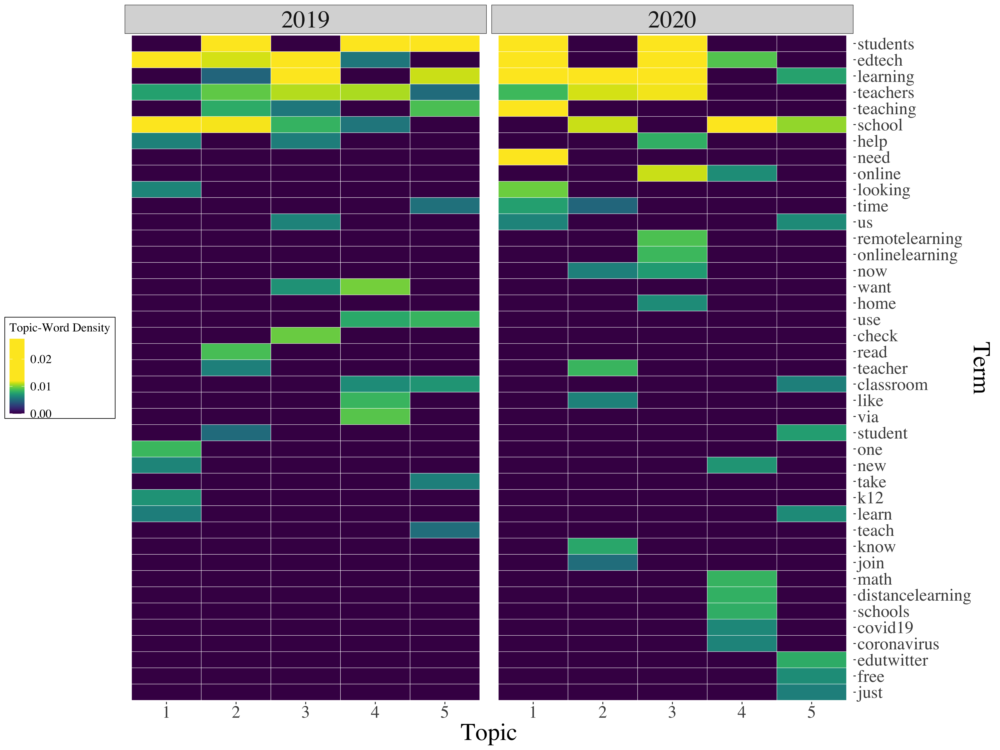

```{r setup, include=FALSE}
usethis::use_git_ignore(c("*.csv", "*.rds"))
options(htmltools.dir.version = FALSE)

#titleSlideClass: [inverse, center, middle]
#"default", "metropolis", "metropolis-fonts", 

# see options for customize slides: 
# https://slides.yihui.name/xaringan/
# https://slides.yihui.name/xaringan/incremental.html
# https://github.com/yihui/xaringan/wiki

library(knitr)
library(tidyverse)
library(xaringan)
```

class: inverse, center, middle

# Slides

[bretsw.github.io/job-talk-uf](https://bretsw.github.io/job-talk-uf/)

---

class: inverse, center, middle

# Introduction

```{r, out.width = "720px", echo = FALSE, fig.align = "center"}
include_graphics("img/network.jpg")
```

---

# Networked learning

```{r, out.width = "600px", echo = FALSE, fig.align = "center"}
include_graphics("img/network.jpg")
```

--

I study networked learning in online communities.

--

My work is **broad** in terms of methods and contexts

--

yet **focused** on some core questions 

---

# Possibilities and perils

```{r, out.width = "600px", echo = FALSE, fig.align = "center"}
include_graphics("img/caution.jpg")
```

--

These questions conjure **possibilities** of the best of what could be, 

--

but also **perils** of what has been and worst-case scenarios. 

---

# Learning analytics

```{r, out.width = "600px", echo = FALSE, fig.align = "center"}
include_graphics("img/code.jpg")
```

**Data science and learning analytics** techniques have helped me make sense of, and answer, some core questions around networked learning in online communities.

---

# Definition: Networked learning

```{r, out.width = "420px", echo = FALSE, fig.align = "center"}

```

**Possibilities:**

--

- The internet creates novel social and environmental conditions for learning

--

- Especially *ad hoc*, *self-directed*, *just-in-time* learning

--

**Perils:**

--

- This learning is *informal* (shallow?)

---

# Definition: Online communities

```{r, out.width = "420px", echo = FALSE, fig.align = "center"}

```

**Possibilities:**

--

- Emphasis on shared affinity, not resemblance to traditional communities

--

- e.g., Facebook group, Twitter hashtag, subreddit

--

**Perils:**

--

- These communities are *chaotic* (disjointed?)

---

# Definition: Digital traces

```{r, out.width = "420px", echo = FALSE, fig.align = "center"}

```

**Possibilities:**

--

- Residual, observable evidence of online activity

--

- e.g., tweets, forum posts, user profiles

--

**Perils:**

--

- This evidence is *noisy* (indecipherable?)

---

# Learning analytics

```{r, out.width = "480px", echo = FALSE, fig.align = "center"}

```

**Data science and learning analytics** techniques have helped me:

--

- Find *meaning* in the informal

--

- See *order* in the chaos

--

- *Listen* through the noise

---

# Learning analytics

```{r, out.width = "480px", echo = FALSE, fig.align = "center"}
include_graphics("img/code.jpg")
```

**Data science and learning analytics** techniques have allowed me to investigate networked learning in online communities by:

--

- Studying real world, in situ data in massive quantities

--

- Identifying patterns and trends

--

-	Inferring possibilities and perils

---

class: inverse, center, middle

# Core Questions

```{r, out.width = "720px", echo = FALSE, fig.align = "center"}
include_graphics("img/question.jpg")
```

---

class: inverse, center, middle

# How and why are teachers using Twitter?

---

# Twitter how and why

```{r, out.width = "360px", echo = FALSE, fig.align = "center"}
include_graphics("img/twitter-purposes.png")
```

<p style="font-size:66%">
Staudt Willet, K. B. (2019). Revisiting how and why educators use Twitter: Tweet types and purposes in #Edchat. <i>Journal of Research on Technology in Education, 51</i>, 273-289. https://doi.org/10.1080/15391523.2019.1611507
</p>

<hr>

--

**Context:** Twitter (\#Edchat hashtag)

--

**Possibilities and perils:** 

--

**Data Collection:** 1,228,506 \#Edchat tweets

--

**Analysis:** tweet type classification, discourse analysis 

---

# Tweet example

```{r, out.width = "540", echo = FALSE, fig.align = "center"}
include_graphics("img/tweet-example.png")
```

---

# Twitter hashtags

```{r, out.width = "180px", echo = FALSE, fig.align = "center"}
include_graphics("img/hashtag.jpg")
```

--

**Many different uses of Twitter hashtags:**

--

- Topical index: #Teaching

--

- Humor and wit: #CoolTeacher

--

- Synchronous chats: #SatChat

--

- "Space" for ongoing discussions: #Edchat, #ITeachMath

---

# \#Edchat background

```{r, out.width = "180px", echo = FALSE, fig.align = "center"}
include_graphics("img/hashtag.jpg")
```

--

- \#Edchat is one of the oldest and busiest educational Twitter hashtags

--

- \#Edchat is self-described as:

> "...Twitter discussion that any educator can discuss and learn about current teaching trends, to integrate technology, to transform their education, and to connect with inspiring instructors around the world."

---

# Twitter how and why

(bar graph: purposes in retweets)

---

# Twitter how and why

(bar graph: purposes in original posts)

---

# Twitter how and why

(bar graph: full comparison)

---

# Twitter how and why

```{r, out.width = "600px", echo = FALSE, fig.align = "center"}
include_graphics("img/twitter-purposes.png")
```

### Conclusions

--

- 

---

class: inverse, center, middle

# What are the implications of spam for research on educational Twitter hashtags?

---

# Twitter spam

```{r, out.width = "360px", echo = FALSE, fig.align = "center"}

```

<p style="font-size:66%">
Carpenter, J. P., Staudt Willet, K. B., Koehler, M. J., & Greenhalgh, S. P. (2020). Spam and educators’ Twitter use: Methodological considerations and challenges. <i>TechTrends, 64</i>, 460-469. https://doi.org/10.1007/s11528-019-00466-3
</p>

<hr>

--

**Context:** Twitter (variety of educational hashtags, e.g., #Edchat, #satchat)

--

**Possibilities and perils:** 

--

**Data Collection:** 1,228,506 #Edchat tweets; 507,071 #satchat tweets

--

**Analysis:** secondary analysis, spam detection

---

# Twitter spam

```{r, out.width = "840px", echo = FALSE, fig.align = "center"}

```

---

# Twitter spam

```{r, out.width = "600px", echo = FALSE, fig.align = "center"}

```

### Conclusions

--

- 

---

class: inverse, center, middle

# How does Twitter participation differ between chat and non-chat contexts?

---

# Twitter chat and non-chats

```{r, out.width = "360px", echo = FALSE, fig.align = "center"}
include_graphics("img/timing.png")
```

<p style="font-size:66%">
Greenhalgh, S. P., Rosenberg, J. M., Staudt Willet, K. B., Koehler, M. J., & Akcaoglu, M. (2020). Identifying multiple learning spaces within a single teacher-focused Twitter hashtag. <i>Computers and Education, 148</i>, 103809. https://doi.org/10.1016/j.compedu.2020.103809
</p>

<hr>

--

**Context:** Twitter (\#michED hashtag)

--

**Possibilities and perils:** 

--

**Data Collection:** 84,004 \#michED tweets

--

**Analysis:** natural language processing, multi-level modeling

---

# Twitter chat and non-chats

(bar graph: response rate in r/education)

---

# Twitter chat and non-chats

```{r, out.width = "600px", echo = FALSE, fig.align = "center"}
include_graphics("img/timing.png")
```

### Conclusions

--

- 

---

class: inverse, center, middle

# How have Twitter educational conversations changed during COVID-19?

---

# Twitter during COVID-19

```{r, out.width = "360px", echo = FALSE, fig.align = "center"}

```

<p style="font-size:66%">
Greenhow, C. M., Staudt Willet, K. B., & Galvin, S. (in revision). Inquiring tweets want to know: #Edchat supports for #RemoteTeaching during COVID-19. <i>British Journal of Educational Technology</i>.
</p>

<hr>

--

**Context:** Twitter (\#Edchat hashtag)

--

**Possibilities and perils:** 

--

**Data Collection:** 589,770 \#Edchat tweets spanning 2019 and 2020

--

**Analysis:** trend analysis, natural language processing, topic modeling

---

# Twitter during COVID-19

```{r, out.width = "360px", echo = FALSE, fig.align = "center"}

```

### Findings

--

- Across all topics in both years, terms like edtech, learn(-ing), teach(-ing or -er), and school were common

--

- **2019:** Two topics related to new K-12 resources, two topics on teaching, and one specifcally on reading

--

- **2020:** Two topics communicating a sense of urgency (Topics 1, 2), two topics specifically related to pandemic themes, and one appealing to fellow educators (i.e., "edutwitter") for free classroom resources

---

# Twitter during COVID-19

```{r, out.width = "360px", echo = FALSE, fig.align = "center"}

```

### Conclusions

- Twitter educational conversation adapted to external, contextual circumstances

---


class: inverse, center, middle

# How have teacher conversations on Reddit changed over time?

---

# Change over time

```{r, out.width = "480px", echo = FALSE, fig.align = "center"}
include_graphics("img/across-time.jpg")
```

<p style="font-size:66%">
Staudt Willet, K. B., & Carpenter, J. P. (in press). A tale of two subreddits: Change and continuity in teaching-related online spaces. <i>British Journal of Educational Technology</i>. https://doi.org/10.1111/bjet.13051
</p>

<hr>

--

**Context:** Reddit (themed discussion forums called *subreddits*)

--

**Possibilities and perils:** Online participation can change quickly, meaning a snapshot may be misleading

--

**Data Collection:** 1,036,278 Reddit posts and comments from two subreddits, spanning 3.5 years

--

**Analysis:** trend analysis, natural language processing, social network analysis

---

# Change over time

(bar graph: response rate in r/education)

---

# Change over time

(bar graph: thread length in r/education)

---

# Change over time

(bar graph: policy discourse in r/Teachers)

---

# Change over time

```{r, out.width = "600px", echo = FALSE, fig.align = "center"}
include_graphics("img/across-time.jpg")
```

### Conclusions

--

- Continuity and change of various measures in relationship with each other may suggest more nuanced interpretation

--

- Networked learning is linked to contextual circumstances and factors

---

class: inverse, center, middle

# Tools I've Built

---

# R package {tidytags}

```{r, out.width = "420px", echo = FALSE, fig.align = "center"}

```

<p style="font-size:66%">
Staudt Willet, K. B., & Rosenberg, J. M. (2020). Simple collection and powerful analysis of Twitter data (v. 0.1.1). https://github.com/bretsw/tidytags
</p>

<hr>

- Datasets of this size will not open in Excel, so I learned R

--

- I wanted to make data collection and analysis easier for others, so I built an R software package

--

- In revision with ROpenSci &mdash; a collection "best in class" software tools

---

# Machine learning classifier

```{r, out.width = "420px", echo = FALSE, fig.align = "center"}
include_graphics("img/sort.jpg")
```

<p style="font-size:66%">
Staudt Willet, K. B., & Willet, B. D. (2018, October). Look who’s talking: Using human coding to establish a machine learning approach to Twitter education chats. In <i>AoIR selected papers of internet research</i>. Association of Internet Researchers. https://spir.aoir.org/ojs/index.php/spir/article/view/10512
</p>

<hr>

--

- Goal: Automatically detect tweet purposes through a *logistic regression classifier*

--

  - identified 39 tweet features

--

  - compared efficacy of 10 different ML methods (e.g., random forest, *k*-nearest neighbors)

---

class: inverse, center, middle

# Significance

---

# Possibilities

```{r, out.width = "300px", echo = FALSE, fig.align = "center"}
include_graphics("img/chat.jpg")
```

--

**Teachers come together through social media in a variety of ways:**

--

- For just-in-time professional development through an emergency response network (Greenhow, Staudt Willet, & Galvin, in revision)

--

- To self-direct their professional learning (Staudt Willet & Carpenter, in press)

--

- To find and share teaching resources (Greenhow, Staudt Willet, & Galvin, in revision; Staudt Willet, 2019; Staudt Willet & Carpenter, in press)

--

- To vent and seek emotional support (Greenhow, Staudt Willet, & Galvin, in revision; Staudt Willet, 2019; Staudt Willet & Carpenter, in press)

---

# Perils

```{r, out.width = "420px", echo = FALSE, fig.align = "center"}
include_graphics("img/caution.jpg")
```

--

-	Individual contributors can overwhelm the community with their **volume** (Carpenter, Staudt Willet, Koehler, & Greenhalgh, 2019) or **self-promotional nature** (Staudt Willet, 2019) of content

--

- Participants' professional and private lives can be brought together in potentially undesired ways (Staudt Willet & Carpenter, in press)

--

-	Participants can be put at risk due to platforms (and researchers) treatment of data privacy and profit model (Krutka, Heath, & Staudt Willet, 2019)

---

# Perils

```{r, out.width = "480px", echo = FALSE, fig.align = "center"}

```

"Your scientists were so preoccupied with whether they *could*, they didn't stop to think if they *should*."

~ Dr. Ian Malcolm, *Jurassic Park*

<hr>

--

Alternative talk title: 

*Your bioengineered T-Rex is awesome, but she will likely eat you*

---

class: inverse, center, middle

# Future research

---

# Future research: Possibilities

```{r, out.width = "420px", echo = FALSE, fig.align = "center"}
include_graphics("img/transition.jpg")
```

--

My past work has shown that data science and learning analytics techniques can bring important insight into networked learning in online communities

--

More work is needed to understand **learning during transitions**:

--

- Disaster response: e.g., pandemics (in progress)

--

- Job transitions: e.g., new teachers, new faculty, promotions (in progress)

--

- Skill development: e.g., educational data science (in progress)
  
---

# Future research: Perils

```{r, out.width = "420px", echo = FALSE, fig.align = "center"}
include_graphics("img/ethics.png")
```

--

More work is needed around some of the perils I've identified:

--

- **Equity:**

  - Understanding the motivations and partcipation of "lurkers"
  
--
  
  - Recommendations for social media users
  
--

- **Ethics:**

  - Balancing privacy and open science (Rosenberg & Staudt Willet, in press)
  
--

  - Accountability for tech companies

---

# Future research: Tools

```{r, out.width = "480px", echo = FALSE, fig.align = "center"}
include_graphics("img/construction.jpg")
```

More work is needed **to keep building and improving** these works-in-progress:

--

- R packages for data collection and analysis (Twitter, Reddit)

--

- Web apps for classifying learning spaces (Twitter, Reddit)

---

# Conclusion

---

# Interdisciplinary research

```{r, out.width = "420px", echo = FALSE, fig.align = "center"}
include_graphics("img/network.jpg")
```

This work brings together ideas from numerous disciplines:

--

- Learning analytics and data science

--

- Emerging technologies

--

- Information science

--

- Teacher education and teacher learning


---

# Final thoughts

```{r, out.width = "420px", echo = FALSE, fig.align = "center"}
include_graphics("img/network.jpg")
```

- Affordances and constraints of the internet create novel social and environmental conditions for learning

--

- These can be studied through data science and learning analytics techniques

--

- This advanced learning technology is worth further study and investment


---

class: inverse, left, top

# Questions?

```{r, out.width = "360px", echo = FALSE, fig.align = "center"}
include_graphics("img/question.jpg")
```

* **Email:** [staudtwi@msu.edu](mailto:staudtwi@msu.edu)

* **Web:** [bretsw.com](http://bretsw.com)

* **Twitter:** [@bretsw](https://twitter.com/bretsw)

* **GitHub:** [bretsw](https://github.com/bretsw)

* **Slides:** [bretsw.github.io/job-talk-uf](https://bretsw.github.io/job-talk-uf)

---

class: inverse, center, middle

# Appendix

---

# Reddit post example

```{r, out.width = "840", echo = FALSE, fig.align = "center"}
include_graphics("img/reddit-example.jpg")
```

---

# Reddit trends

**Daily contributions to r/Teachers and r/education**

```{r, out.width = "840px", echo = FALSE, fig.align = "center"}
include_graphics("img/subreddit-contributions-over-time-comparison.png")
```

---

# Reddit discourse

**Post topics and discourse in r/Teachers and r/education**

```{r, out.width = "450px", echo = FALSE, fig.align = "center"}
include_graphics("img/subreddit-post-plot-bar.png")
```

---

# Twitter trends

**Daily \#Edchat tweets in 2019 vs. 2020**

```{r, out.width = "840px", echo = FALSE, fig.align = "center"}
include_graphics("img/daily-tweets-comparison.png")
```

---

# Twitter log odds ratio

**Hashtags in \#Edchat tweets in 2019 vs. 2020**

```{r, out.width = "840px", echo = FALSE, fig.align = "center"}
include_graphics("img/hashtag-comparison-scatter.png")
```

---

# Twitter topic models

**Topics in \#Edchat question tweets in 2019 vs. 2020**

```{r, out.width = "680px", echo = FALSE, fig.align = "center"}

```